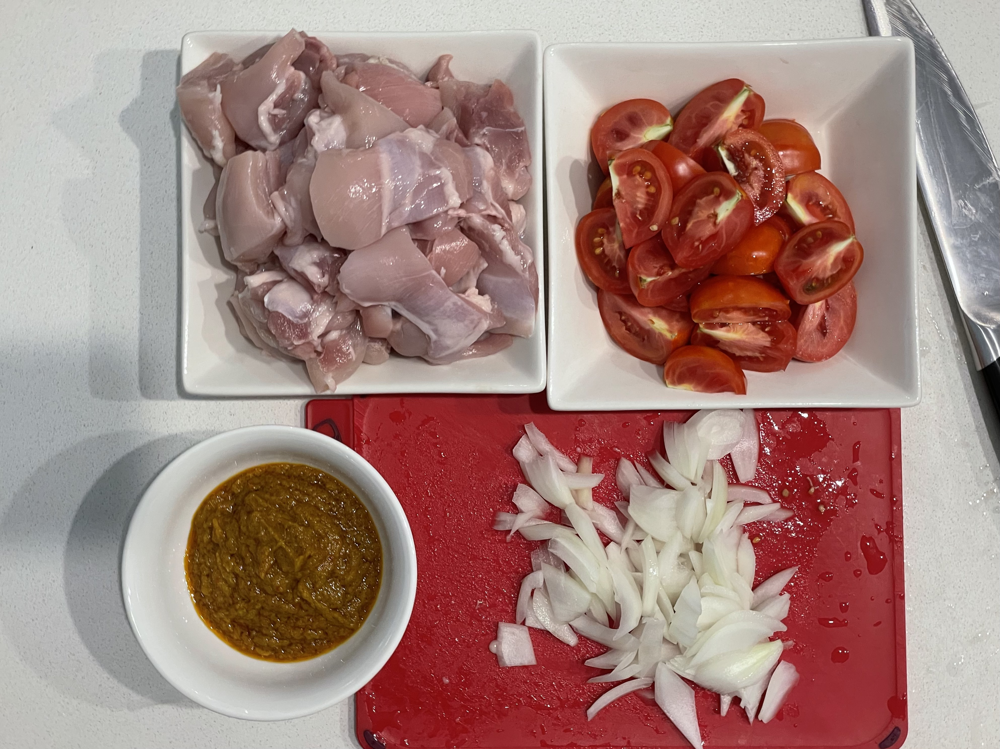
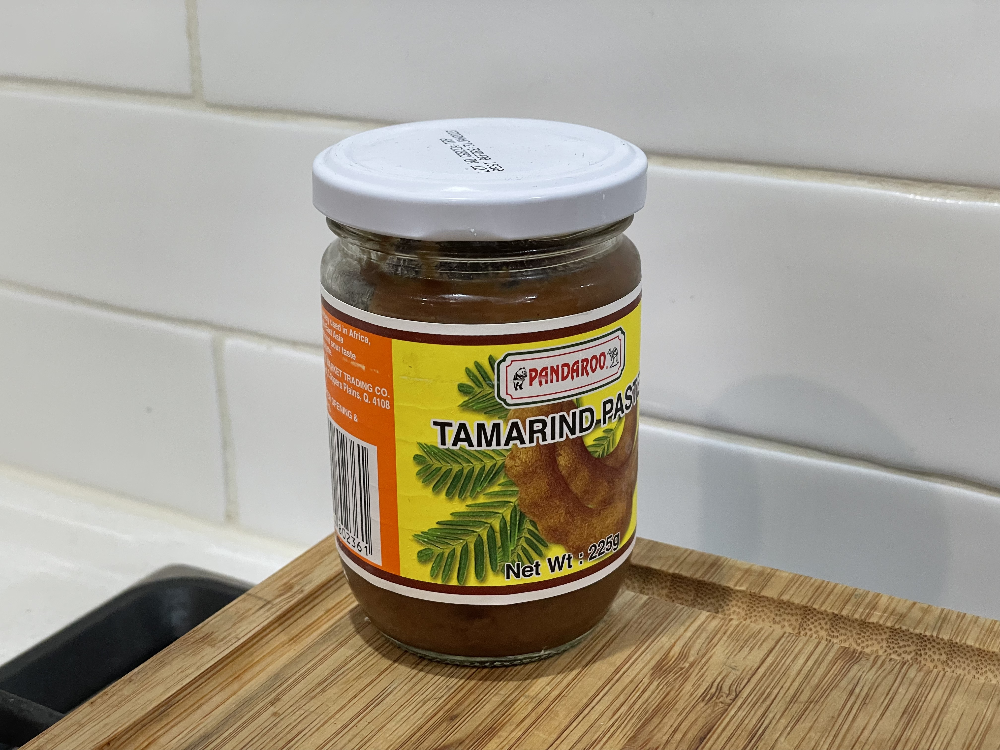

The rempah ingredients are from Ah Tai's notes. Can also use [this recipe]().

## Ingredients
* ~150 g rempah
  * Belacan
  * Chilli
  * Onions
  * Lemongrass
  * Galangal
  * Turmeric
* 1kg chicken thigh, cut in large pieces
* Tomatoes, cut in wedges
* 1 onion, coarsely chopped
* Tamarind paste, diluted with water
* Sugar
* Mint leaves/laksa leaves (optional)

## Method
1. Use pre-made rempah, or grind rempah ingredients and fry in lots of oil until fragrant. Set aside.
2. Fry onions in oil until caramelised well. Then add rempah and fry for a few more minutes.

3. Add chicken, stir well and cover. Cook for a few minutes until the outside of the chicken has browned.

4. Add tomato, stir well and cover. Cook for around 20 minutes, stirring occasionally. The tomato should be completely broken up.

5. Adjust taste with tamarind water, salt and sugar.

