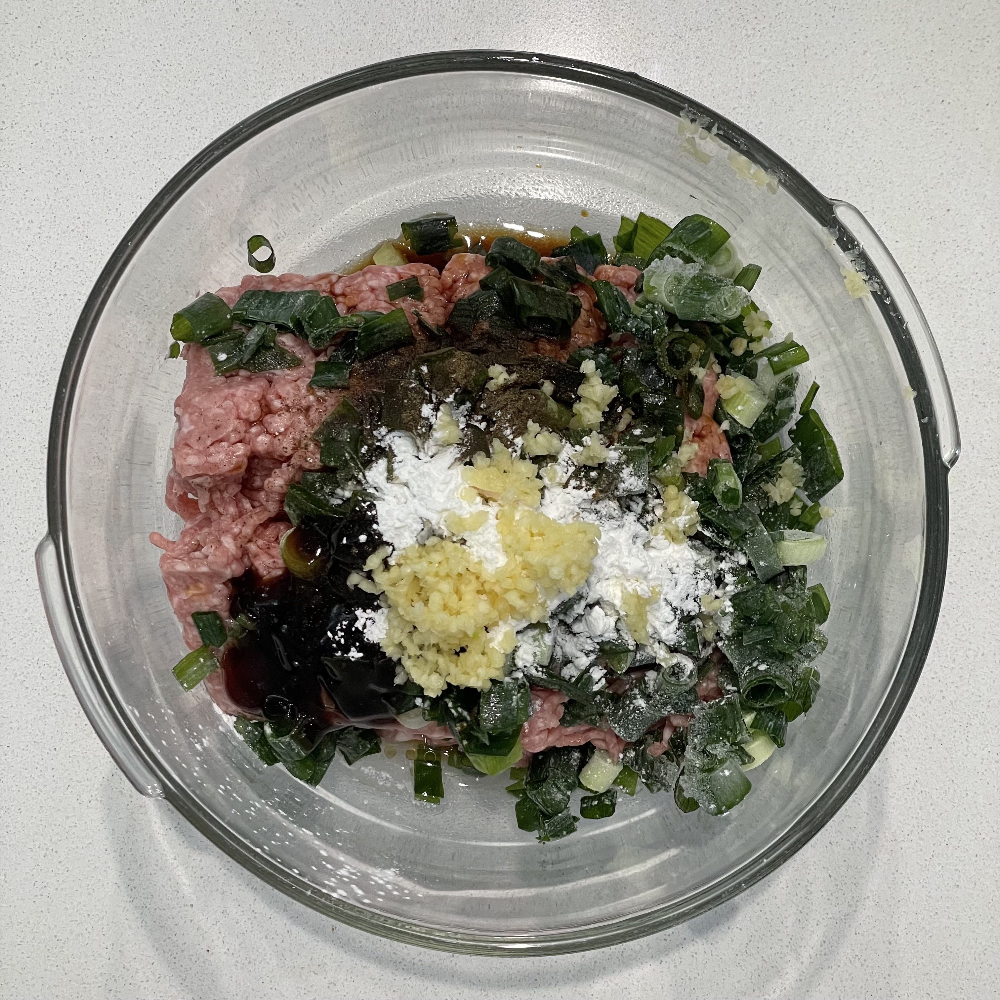
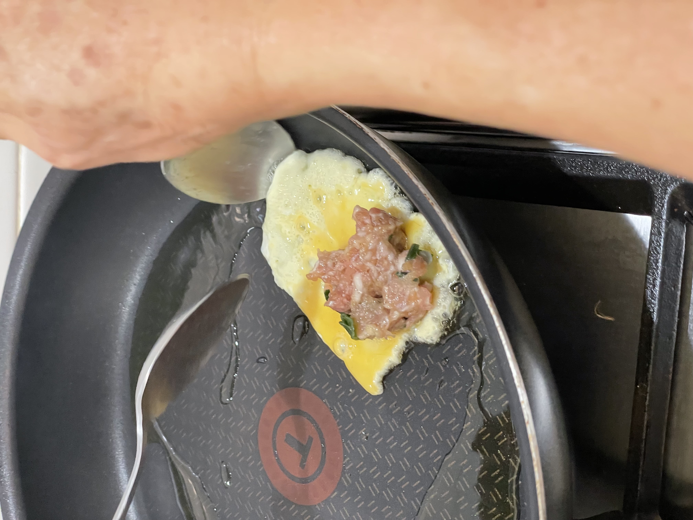
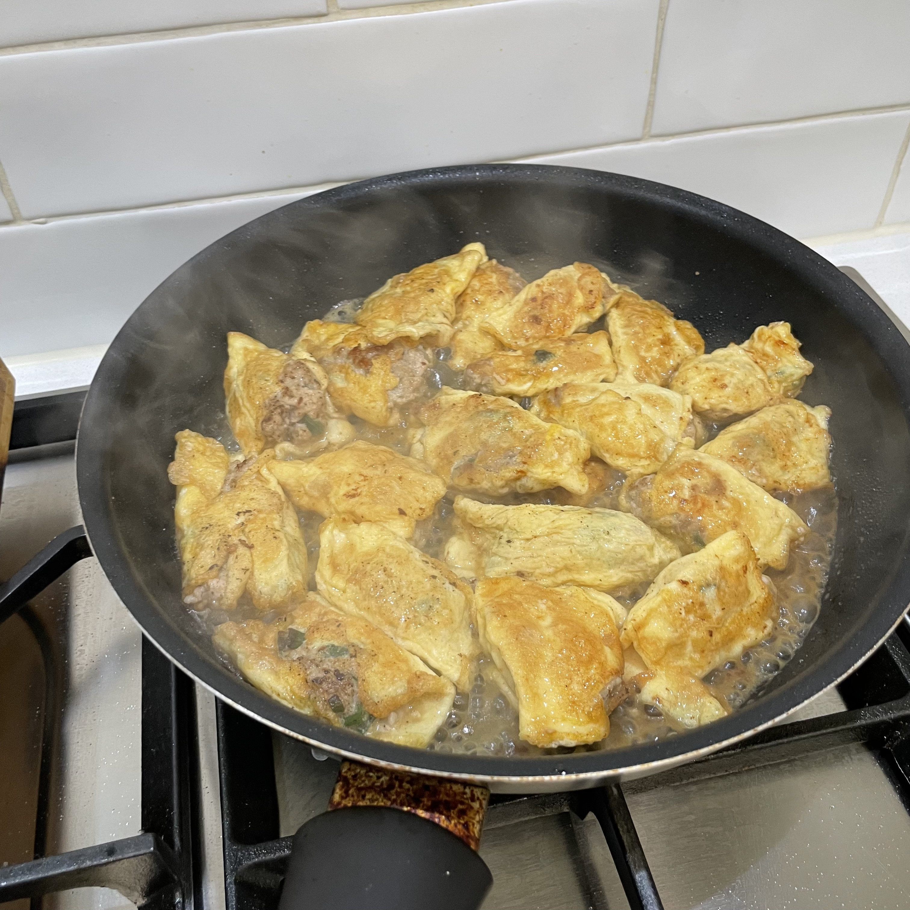

## Ingredients
* Omelette
  * 3 eggs
  * Salt
  * Pepper
  * Sesame oil
* Filling
  * Pork mince
  * Spring onion
  * Crushed garlic
  * Soy sauce
  * Cooking wine
  * Oyster sauce
  * Sesame oil
  * Pepper
  * Corn flour or egg (for binding)
  * Sugar

## Method
1. Mix the filling ingredients in a mixing bowl.

2. Mix together the omelette ingredients and beat thoroughly.
3. Heat a frying pan with oil. Add 1 tablespoon of egg mixture to the pan, then immediately spoon some filling onto the egg. 

4. Wrap up the egg roll and flip over. Fry on both sides until browned, then remove onto a plate.

5. Repeat until ingredients are used up.

6. Add all the cooked egg rolls back to the pan. Add some water and cover. Cook until water has evaporated.
