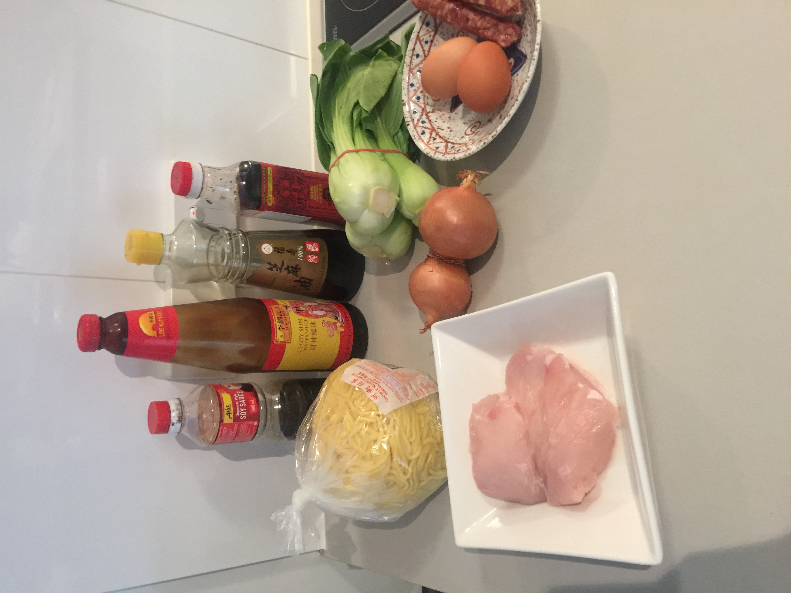

## Ingredients
* 1 packet (~1kg) Hokkien noodles
* Chicken thigh fillets, roughly chopped
* Soy sauce
* Oyster sauce
* Sesame oil
* Cooking caramel (karamel masakan)
* Bok choy, leaves and stems separated, stems cut in half.
* 2 onions, diced
* 2 eggs, beaten
* 2 pieces Chinese sausage (lup chong), sliced thinly on a diagonal

## Method
* Marinate chicken in pepper and soy sauce, add a little bit of oyster sauce, sesame oil, sugar, ginger and garlic.
* Cook each ingredient separately in a pan:
    * *Egg.* Fry like omelet in olive oil, break up into smaller pieces. Set aside.
    * *Chinese sausage.* It is very fatty, needs little oil and the fat can be used to cook other things. Watch carefully can burn very quickly. Cook until kinda translucent (a minute or two). Set aside.
    * *Bok choy.* First add a little crushed ginger and garlic. Cook stems first until half cooked and then add leaves. Season with salt and pepper and a little sesame oil. Cook until almost done. Set aside.
    * *Chicken.* Cook until fully cooked. Set aside.
* Cook onion with crushed ginger and garlic until browned.
* Then add boiling water and season: salt, pepper, oyster sauce, sesame oil, dark cooking sauce (caramel cooking sauce), a teaspoon of sugar, soy sauce--adjust amounts for taste.
* When the water is boiling, add noodles making sure to break up clumps. Add extra caramel cooking sauce to get the right colour.
* Cook down until dry so noodles get fried then add a little more water for gravy.
* Add all other ingredients--sausage, chicken, vege and egg. Remove from heat and serve.