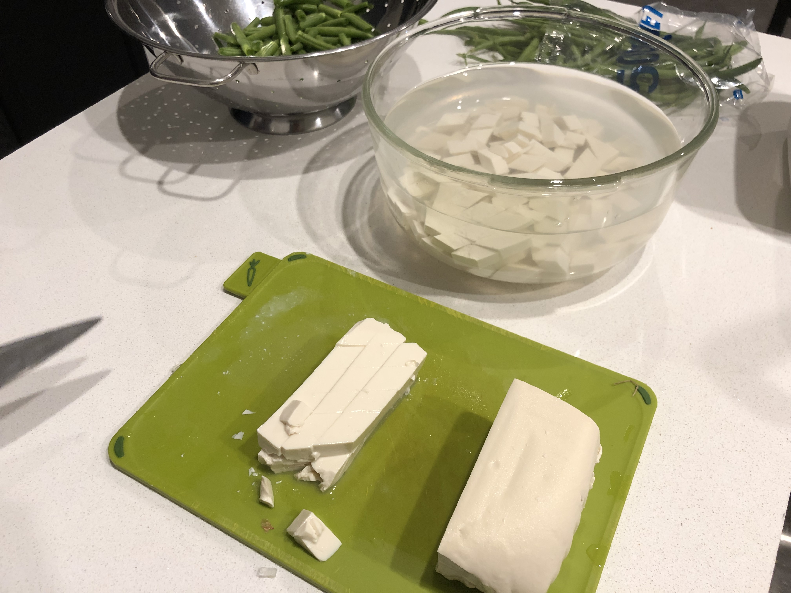
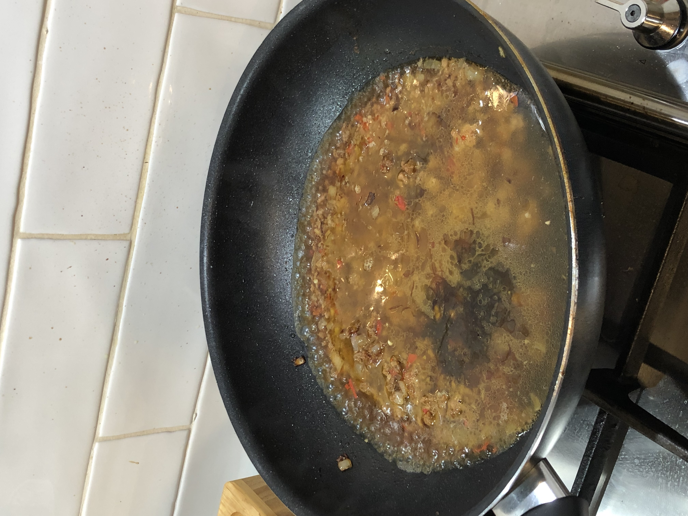

This recipe was adapted by Mum from cousins' grandpa who used to run a Taiwanese restaurant.

## Ingredients
* 1 pack soft tofu
* Minced pork
* Diced onion
* Crushed garlic and ginger
* Sliced chilli

## Method
1. Cut soft tofu into diamonds and soak in water.

2. Marinate the mince in soy sauce, wine, oyster sauce, etc.
3. In wok, fry onion, garlic, ginger and chilli.
4. When done, add cooked marinated mince.
5. Add cooking wine.
6. Start sauce by adding some hot water.

7. Seasoning is whatever you want. Mum adds oyster sauce, sesame oil, sugar, pepper, cooking caramel. Adjust to taste.
8. Once happy with seasoning, add drained tofu. Tofu should be rinsed twice until clear.
9. Let tofu boil for a few minutes until cooked.
10. Add some cornstarch+water and stir to thicken.
11. Add chopped spring onion and serve.