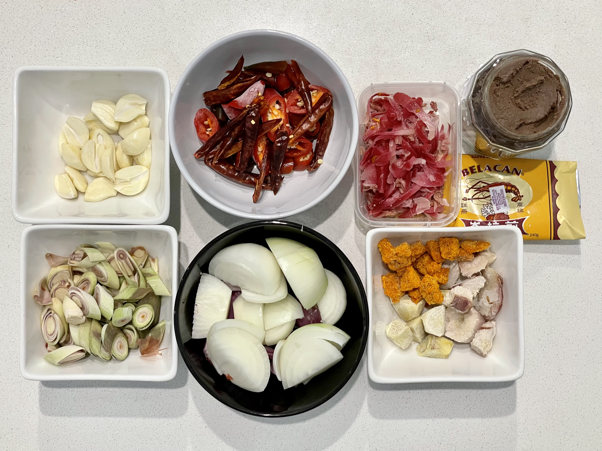
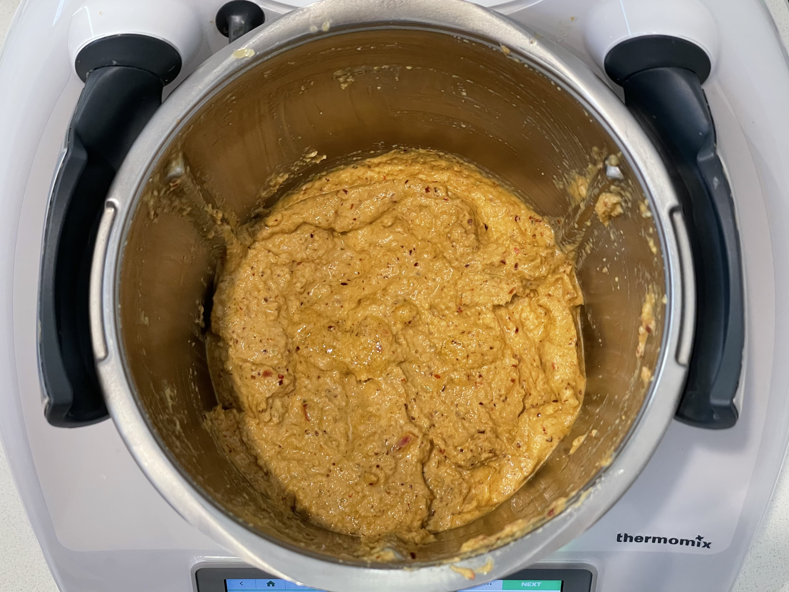
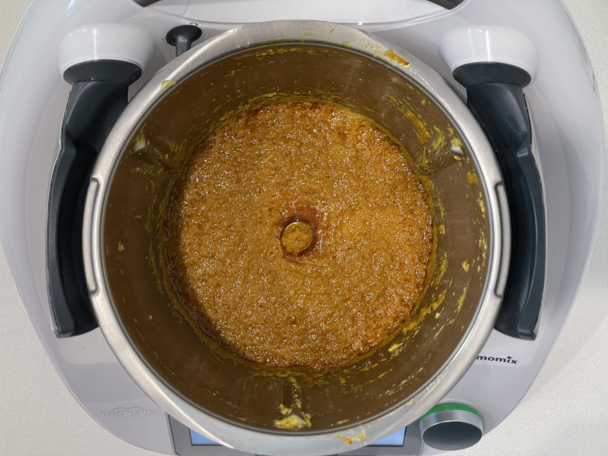

## Ingredients
* 20 g dried chilli, deseeded, soaked to soften
* 5 fresh chilli, deseeded
* 250 g shallot onions
* 10 garlic cloves
* 6 lemongrass stalks (white part only)
* 30 g fresh galangal, chopped
* 20 g fresh ginger, chopped
* 20 g fresh turmeric, chopped
* 1 torch lily bud, chopped (optional)
* 25 g belacan paste/powder, toasted
* 150 g cooking oil
* 20 g sugar
* 15 g salt

## Method
1. Pound or blend together all the ingredients (Thermomix: 5 sec/speed 6, 30 sec/speed 10)

2. Fry in wok for 20-30 minutes until brown and very fragrant (Thermomix: 5 min/120°C/speed 2, 15 min/90°C/speed 2)

