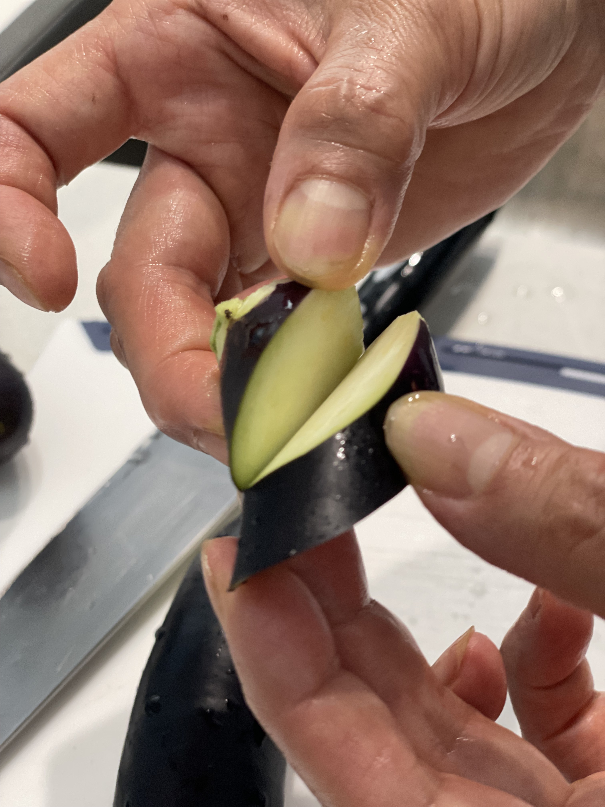

## Ingredients
* Eggplant
* Filling
  * Pork mince
  * Spring onion
  * Crushed garlic
  * Soy sauce
  * Cooking wine
  * Oyster sauce
  * Sesame oil
  * Pepper
  * Corn flour or egg (for binding)
  * Sugar
* Sauce
  * 2 tbsp corn flour
  * Oyster sauce
  * Sesame oil
  * Water
  * Sugar, garlic, five spice (optional)

## Method
1. Mix the filling ingredients in a mixing bowl.

2. Cut the eggplant into ~2cm slices and cut a slit in each slice.

3. Submerge eggplant in a bowl of water and soak for around 10 min. This removes some bitterness.

4. Fill the eggplant with the filling.

5. Optional: coat pieces in corn flour and five spice mixture.

6. Pan fry on low heat with oil. Cover until first side has browned, make sure it doesn’t burn. Then flip all pieces and pan fry on other side. Should take around 5 minutes per side.

7. Add water to pan and cover. Cook until water evaporates.

8. To make the sauce, mix the sauce ingredients in a small bowl and add to 2 cups boiling water. Simmer until thickened, then add spring onion and salt to taste. Pour sauce over eggplant.
