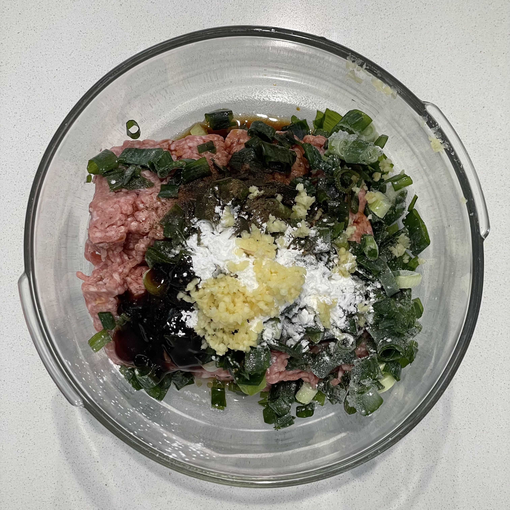
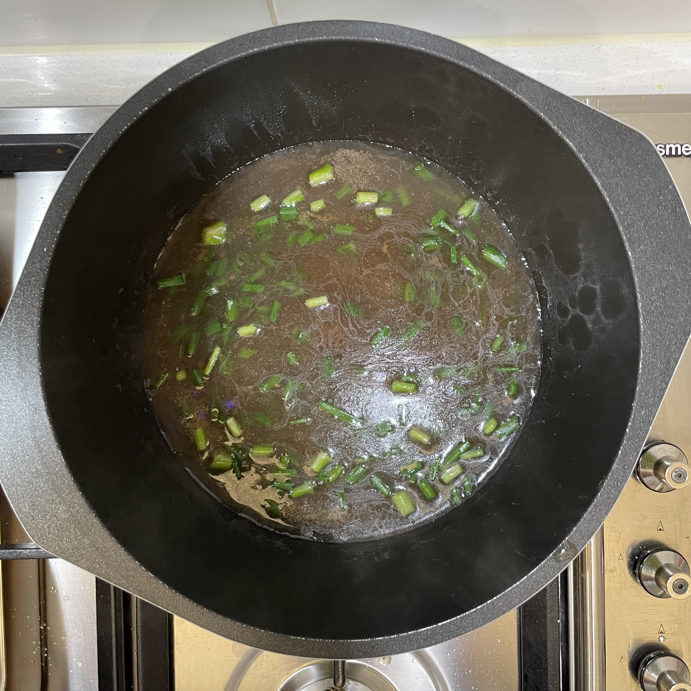

## Ingredients
* Dried shiitake mushrooms
* Filling
  * Pork mince
  * Spring onion
  * Crushed garlic
  * Soy sauce
  * Cooking wine
  * Oyster sauce
  * Sesame oil
  * Pepper
  * Corn flour or egg (for binding)
  * Sugar
* Marinade
  * Five spice powder
  * Salt
  * Pepper
  * Sesame oil
  * Cooking wine
  * Soy sauce (not too much, the mushrooms are already salty)
* Sauce
  * 2 tbsp corn flour
  * Oyster sauce
  * Sesame oil
  * Water
  * Sugar, garlic, five spice (optional)

## Method
* Mix the filling ingredients in a mixing bowl.

* Soak dried shiitake mushrooms in water for around 10 min, then remove and squeeze out excess water.

* Mix the marinade ingredients together and coat the mushrooms.
* Stuff the underside of the mushrooms with the filling.
* Pan fry on low heat with oil and cover until browned.

* Add hot water to pan and cover. Cook until water evaporates.

* To make the sauce, mix the sauce ingredients in a small bowl and add to 2 cups boiling water. Simmer until thickened, then add spring onion and salt to taste. Pour sauce over mushrooms.
